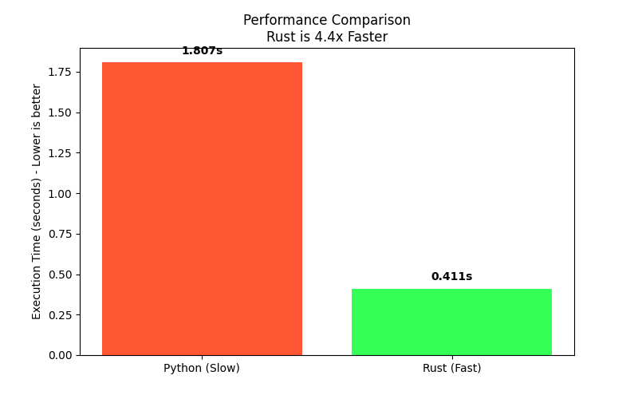

# 🚀 High-Speed Data Processor (Python + Rust)
### *Overcoming Python's performance limits with Rust and PyO3.*



## 🌟 The Problem it Solves
Python is the undisputed king of Data Science and backend logic, but it has a well-known weakness: **it's slow at heavy CPU-bound computations**. When processing millions of rows of financial data, logs, or analytics, pure Python loops can become a massive bottleneck, increasing server costs and delaying critical business insights.

## 🛠 The Solution
Instead of rewriting the entire backend, I built a **hybrid architecture**:
1. **Python** remains the control layer (for its ease of use and rich ecosystem).
2. **Rust** handles the heavy lifting. I extracted the most resource-intensive mathematical operations into a compiled Rust module using `PyO3`.

## 📈 The Result
By executing a benchmark on a dataset of **5,000,000 data points**, the Rust extension achieved a **4.4x speedup** compared to the pure Python implementation. In a production environment, this means turning a 10-hour data processing job into a 2.2-hour job, significantly reducing AWS/GCP cloud billing.

## ⚙️ Tech Stack
- **Languages:** Python 3.14, Rust (2021 Edition)
- **Bridge/Bindings:** PyO3, Maturin
- **Visualization:** Matplotlib

## 🚀 How to Run Locally
1. Clone the repository.
2. Ensure you have Rust and Cargo installed (`rustup.rs`).
3. Create a virtual environment and activate it.
4. Install `maturin` and `matplotlib`:
   ```bash
   pip install maturin matplotlib
5. maturin develop --release  **Compile the Rust extension and install it directly into your Python environment**
6. python benchmark.py  **Run the benchmark**

## 🤝 Need to optimize your Python app?
If your Django/FastAPI app or Pandas scripts are running too slow, you don't need to abandon Python. [Contact me] to identify the bottlenecks and rewrite critical paths in Rust or C++ for massive performance gains. https://www.upwork.com/freelancers/~010745b4d221a00300
